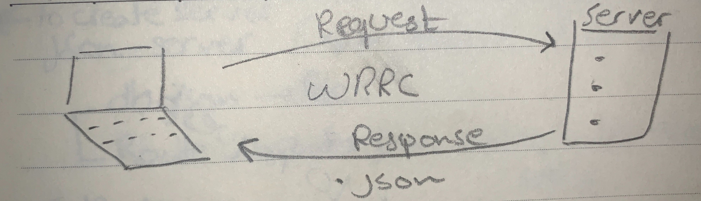

# api-serve
# LAB - Class 02

# Author: 
  -  Amal Almomani
# lab name
  - api-server

## pull request link
  - 
## Links and Resources
  - (swagger hub page)[https://app.swaggerhub.com/apis/AmalMAlmomani/api-server-lab-06/0.1]\
  - (Swagger documentation)[https://app.swaggerhub.com/apis-docs/AmalMAlmomani/api-server-lab-06/0.1]

## Setup
  - .env requirements
    - `PORT - 3000`

## How to use your library (where applicable)
  - npm i express => express
 
## Tests
  - npm i -D jest => jest
  - npm i supertest => lint

## UML
 - 

 